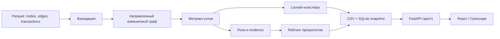

# MoneyGraph — анализ транзакционной сети

MoneyGraph — локальный аналитический инструмент для AML-аналитика, разработанный для кейса HackAlem AI «Граф денег». Он восстанавливает наблюдаемую структуру финансовой сети, присваивает каждому участнику объяснимую роль, выделяет сообщества и формирует очередь на проверку.

Основной сценарий: загрузить предоставленные Parquet, выполнить расчёт, открыть интерфейс, найти клиента по GID и понять, почему он получил свою роль и приоритет.

Роли и оценки являются гипотезами для проверки. Они не устанавливают виновность, личность или намерения клиента.

## Возможности

- Валидация трёх исходных Parquet и согласованности транзакций с агрегированными рёбрами.
- Направленный граф движения денег, включая изолированные узлы.
- Степени узлов, суммы и количество переводов, взвешенный PageRank, pass-through и достижимость от seed.
- Шесть структурных ролей с числовым объяснением для каждого клиента.
- Louvain-кластеризация, характеристики сообществ и гипотезы.
- Рейтинг всех клиентов для углублённой проверки.
- Три CSV-выгрузки и SQLite snapshot для API.
- Веб-интерфейс: обзор, граф, приоритеты, карточки узлов, кластеры, методология и ограничения данных.

## Архитектура



Аналитика выполняется отдельной командой. API читает готовый snapshot и не пересчитывает граф при каждом запросе.

## Структура проекта

```text
backend/
  app/
    analytics/       загрузка, проверка, граф, метрики, роли, кластеры, рейтинг
    api/             HTTP-маршруты
    schemas/         внутренние и внешние модели
    repositories/    чтение snapshot
    db/              запись SQLite и CSV
    core/            настройки
  tests/             автоматические тесты
  out/               результаты расчёта
  analysis.db        рассчитанный SQLite snapshot
  requirements.txt
frontend/
  src/               React-интерфейс и API-клиент
  package.json
docs/
  data/              исходные Parquet
  starter/           стартовый код организаторов
  *.docx             исходное задание
```

`backend/out/` и `backend/analysis.db` создаются командой pipeline.

## Требования к окружению

- Python 3.11 или новее; приведённые команды используют Python 3.11.
- Node.js 20.19+ или 22.12+ и npm.
- Windows, Linux или macOS.
- Интернет для первоначальной установки зависимостей. Расчёт и работа с установленными зависимостями выполняются локально.
- GPU и платные сервисы не требуются.

Backend: FastAPI, Pydantic, pandas, PyArrow, NetworkX, SciPy, SQLite, pytest.
Frontend: React, TypeScript, Vite, Cytoscape.js.

## Быстрый запуск на Windows

Откройте PowerShell в корне репозитория — папке, где находятся `backend`, `frontend` и этот README.

### 1. Установите зависимости backend

```powershell
cd backend
py -3.11 -m venv .venv
./.venv/Scripts/python.exe -m pip install -r requirements.txt
```

Если окружение `.venv` уже создано, повторять его создание не нужно. Команды используют Python из окружения напрямую, поэтому активация и изменение PowerShell ExecutionPolicy не требуются.

### 2. Рассчитайте данные одной командой

Из папки `backend`:

```powershell
./.venv/Scripts/python.exe -m app.analytics.run_pipeline --data-dir ../docs/data --database analysis.db --out-dir out
```

Ожидаемый результат для предоставленного набора и текущего алгоритма:

```text
[OK] nodes: 2248
[OK] edges: 3119
[OK] clusters: 91
[OK] ranked nodes: 2248
Analysis pipeline: PASSED
```

Команда создаёт три CSV в `backend/out` и базу `backend/analysis.db`. При повторном запуске результаты заменяются; строки не накапливаются.

### 3. Запустите backend

В этом же терминале:

```powershell
./.venv/Scripts/python.exe -m uvicorn app.main:app --reload
```

Оставьте терминал открытым.

### 4. Запустите frontend во втором терминале

Откройте второй PowerShell в корне репозитория:

```powershell
cd frontend
npm ci
npm run dev
```

Откройте адрес, напечатанный Vite; обычно это `http://localhost:5173`.

## Запуск на Linux/macOS

Первый терминал, из корня репозитория:

```bash
cd backend
python3.11 -m venv .venv
./.venv/bin/python -m pip install -r requirements.txt
./.venv/bin/python -m app.analytics.run_pipeline --data-dir ../docs/data --database analysis.db --out-dir out
./.venv/bin/python -m uvicorn app.main:app --reload
```

Второй терминал, из корня репозитория:

```bash
cd frontend
npm ci
npm run dev
```

Если Python установлен под другим именем, используйте доступный Python 3.11+ для создания окружения.

## Адреса приложения

| Адрес | Назначение |
|---|---|
| http://localhost:5173 | Интерфейс аналитика, если Vite выбрал порт 5173 |
| http://localhost:8000/docs | Swagger: интерактивное описание API |
| http://localhost:8000/openapi.json | Машиночитаемая схема API |
| http://localhost:8000/health | Проверка работы HTTP-сервиса |
| http://localhost:8000/api/v1/summary | Сводка реального snapshot |

Для остановки сервиса нажмите `Ctrl+C` в его терминале. После изменения исходных данных повторите pipeline. Ответ `/health` подтверждает работу сервиса; наличие аналитических данных проверяется через `/api/v1/summary`.

## Настройки

Файлы `.env` необязательны: значения по умолчанию подходят для локального запуска.

При необходимости скопируйте примеры в соответствующих папках:

```powershell
# Из корня репозитория
Copy-Item backend/.env.example backend/.env
Copy-Item frontend/.env.example frontend/.env
```

На Linux/macOS используйте `cp` вместо `Copy-Item`. Если собственный `.env` уже есть, отредактируйте его вместо перезаписи.

Основные настройки backend:

```dotenv
MONEYGRAPH_DATABASE_PATH=analysis.db
MONEYGRAPH_CORS_ORIGINS=http://localhost:5173,http://127.0.0.1:5173
```

Настройки frontend:

```dotenv
VITE_API_URL=http://localhost:8000/api/v1
VITE_USE_MOCK_API=false
```

Frontend по умолчанию обращается к реальному API. `VITE_USE_MOCK_API=true` включает явно помеченные демонстрационные данные. После изменения переменных frontend перезапустите Vite.

## Исходные данные

Источник: [описание датасета](<docs/README (1).md>) и [starter организаторов](docs/starter/README.md).

| Показатель | Значение |
|---|---:|
| Клиенты | 2 248 |
| Направленные агрегированные рёбра | 3 119 |
| Отдельные транзакции | 4 840 |
| Seed-клиенты | 81 |
| Период | 1–31 июля 2026 |
| Глубина сбора | 4 шага по исходящим переводам |
| Порог включения переводов | 5 000 KZT |
| Наблюдаемый оборот | 365 890 012,01 KZT |

Распределение узлов по `depth`: `0 → 81`, `1 → 472`, `2 → 462`, `3 → 789`, `4 → 444`.

### Схемы Parquet

| Файл | Поля и фактические pandas-типы |
|---|---|
| `nodes.parquet` | `gid: int64`, `depth: int64`, `is_seed: bool` |
| `edges.parquet` | `src: int64`, `dst: int64`, `sum_kzt: float64`, `n_tx: int64`, `depth: int8` |
| `transactions.parquet` | `src: int64`, `dst: int64`, `date: object` с объектами даты, `sum_kzt: float64` |

Одна строка `edges` — агрегат переводов одной направленной пары за период. Одна строка `transactions` — отдельный перевод. Дополнительные колонки допускаются.

### Валидация

Проверяются обязательные поля, семантические типы, null/NaN/infinity, неотрицательные суммы и счётчики, уникальность GID и пар рёбер, глубина узлов `0..4` и рёбер `1..4`, ссылки на существующие узлы. Суммы и количества транзакций сверяются с рёбрами с допуском для дробных сумм.

CLI проверяет ожидаемые количества `2248/3119/4840/81`. Библиотечная валидация позволяет отдельно настраивать ожидания количества строк. Исходные DataFrame не исправляются и не изменяются валидатором.

## Методология

### Граф и метрики

В граф сначала добавляются все GID, затем направленные рёбра `src → dst`. Поэтому 19 изолированных seed сохраняются в результатах.

Для каждого узла вычисляются:

- `in_degree / out_degree` — число входящих/исходящих контрагентов;
- `in_kzt / out_kzt` — суммы наблюдаемых входящих/исходящих переводов;
- `in_tx / out_tx` — количество переводов;
- `total_volume = in_kzt + out_kzt`;
- PageRank на направленном графе с весом `sum_kzt`;
- `pass_through = out_kzt / in_kzt`; при нулевом входе — неопределённое значение;
- `seed_reach_count` — число seed, из которых узел достижим по направлению рёбер; seed достигает себя путём длины ноль;
- `truncated_by_depth = (depth == 4 and out_degree == 0)`;
- percentiles степени, объёма, PageRank и seed reach.

Percentile — относительный ранг среди всех узлов. При равных значениях применяется средний ранг: `rank(method="average", pct=True)`. Поэтому percentile нулевой степени может быть больше нуля. Достижимость от seed считается по доступному графу, без отдельного ограничения длины пути.

Количество транзакций сохраняется и доступно для исследования, но в текущей версии не входит в формулы ролей и приоритета. Анализ дат и временных паттернов пока не реализован.

### Правила ролей

Правила проверяются сверху вниз; первое совпадение определяет единственную основную роль.

| Роль | Формальное правило |
|---|---|
| `coordinator` — координирующий узел | Seed reach percentile ≥ 0.95; PageRank percentile ≥ 0.85; есть входящие и исходящие связи |
| `consolidator` — сборщик | Incoming degree percentile ≥ 0.90; volume percentile ≥ 0.75; `in_degree > out_degree` |
| `distributor` — распределитель | Outgoing degree percentile ≥ 0.90; volume percentile ≥ 0.65; `out_degree > in_degree` |
| `transit` — транзит | Не seed; не обрезан глубиной; есть вход и выход; `0.80 ≤ pass_through ≤ 1.20` |
| `terminal` — конечный получатель в наблюдаемых данных | Есть вход; `out_degree = 0`; `depth < 4` |
| `peripheral` — прочие узлы | Ни одно предыдущее правило не сработало |

Роль `peripheral` означает отсутствие совпадения с заданными правилами, а не доказанное отсутствие значимости. Узел может соответствовать нескольким паттернам, но основная роль зависит от указанного порядка.

### Формулы role_score

Обозначения: `I` — percentile входящей степени; `O` — исходящей; `V` — объёма; `P` — PageRank; `S` — seed reach; `r` — pass-through.

```text
coordinator:  (S + P + I + O) / 4
consolidator: (I + V + P) / 3
distributor:  (O + V + P) / 3
transit:      (max(0, 1 - abs(r - 1) / 0.2) + I + O) / 3
terminal:     (I + V + (1 - O)) / 3
peripheral:   1 - max(I, O, V, P)
```

Результат ограничивается диапазоном `0..1`. Это эвристическая сила соответствия роли; вероятностная калибровка на размеченных данных не проводилась.

`evidence` формируется детерминированно из рассчитанных метрик, содержит числа и не превышает 200 символов. Генерация через LLM не используется.

### Приоритет

```text
degree_percentile = (I + O) / 2

priority_score =
    0.25 × P
  + 0.20 × S
  + 0.25 × role_score
  + 0.20 × V
  + 0.10 × degree_percentile
```

Рейтинг сортируется по убыванию `priority_score`, при равенстве — по возрастанию GID. Весовые коэффициенты являются выбранной эвристикой, а не обученной моделью. Текущий `why` в рейтинге повторяет evidence роли; отдельная расшифровка вклада каждого слагаемого в UI пока отсутствует.

### Кластеризация

Louvain применяется к неориентированной проекции. Встречные суммы между парой узлов складываются. Вес — `sum_kzt`, случайный seed алгоритма — `42`. Исходный граф для потоков остаётся направленным.

ID кластеров назначаются после сортировки сообществ по минимальному GID. Для каждого сообщества вычисляются размер, число seed, сумма внутренних направленных рёбер и пять ведущих узлов по PageRank. Гипотеза формируется по размеру и наличию seed и служит начальной подсказкой для аналитика.

На предоставленном наборе текущая реализация выдаёт 91 кластер, из них 8 содержат несколько seed. Число кластеров является результатом алгоритма, а не фиксированным требованием к другим данным.

## Результаты и форматы выгрузок

| Файл | Обязательные колонки |
|---|---|
| `out/nodes_roles.csv` | `gid, role, role_score, cluster_id, priority_score, evidence` |
| `out/clusters.csv` | `cluster_id, n_nodes, n_seed, sum_kzt_internal, top_gids, hypothesis` |
| `out/top_nodes.csv` | `rank, gid, role, priority_score, why` |

Для текущего набора: 2 248 строк в `nodes_roles.csv`, 91 в `clusters.csv`, 2 248 в `top_nodes.csv`. Все узлы входят в один кластер. `top_gids` содержит сериализованный список идентификаторов.

GID в Parquet/SQLite сохраняется целым числом, а в CSV — точной десятичной записью. При открытии CSV в Excel импортируйте GID как текст: 18-значные значения могут потерять точность при автоматическом преобразовании.

Pipeline атомарно заменяет файл SQLite. CSV записываются отдельными файлами; общей транзакции для SQLite и всех CSV нет. После ошибки записи следует устранить причину и повторить pipeline.

Выгрузки нужно включить в сдаваемый комплект или получить командой pipeline. Их наличие на локальном диске само по себе не гарантирует, что они включены в Git.

## Как пользоваться интерфейсом

1. Откройте **Обзор** и проверьте объём данных, распределение ролей и приоритетные узлы.
2. В **Приоритетах** найдите GID или выберите роль; откройте карточку и прочитайте evidence.
3. Перейдите в **Сеть**. Клик по узлу выделяет его окружение и показывает краткие показатели. Клик по ребру показывает направление, сумму и количество переводов.
4. В **Кластерах** выберите сообщество и откройте его граф.
5. Перед выводами прочитайте **Методологию** и **Ограничения данных**.

Текущий граф GID показывает выбранный узел, его непосредственных входящих и исходящих соседей и связи между включёнными узлами. Это локальное окружение в один шаг. Надпись «4 шага» описывает глубину сбора исходного датасета. Переключателя 1–4 hops сейчас нет.

Граф кластера включает до 1 000 узлов по приоритету. Поле `truncatedAtDepth` относится к границе датасета, а не к этому лимиту отображения. Плотные графы удобнее изучать через выделение узла, увеличение масштаба и карточки.

## API

Все domain endpoints имеют префикс `/api/v1`.

| Метод и путь | Назначение |
|---|---|
| `GET /health` | Состояние сервиса |
| `GET /api/v1/summary` | Сводка, распределение ролей, десять ведущих узлов и кластеров |
| `GET /api/v1/nodes` | Поиск, фильтры и пагинация |
| `GET /api/v1/nodes/{gid}` | Подробные показатели узла |
| `GET /api/v1/nodes/{gid}/graph` | Локальный граф узла |
| `GET /api/v1/top-nodes` | Приоритетные узлы, `limit` от 20 до 100 |
| `GET /api/v1/clusters` | Список кластеров |
| `GET /api/v1/clusters/{cluster_id}` | Подробности кластера |
| `GET /api/v1/clusters/{cluster_id}/graph` | Граф кластера |

Параметры `/nodes`: `role`, `cluster`, `minPriority`, `isSeed`, `search`, `page`, `pageSize`. Размер страницы — от 1 до 100. `limit` поддерживается как альтернативное имя размера страницы; при одновременном указании приоритет имеет `pageSize`. Поиск работает по подстроке GID.

Примеры:

```text
http://localhost:8000/api/v1/nodes?role=coordinator&page=1&pageSize=20
http://localhost:8000/api/v1/nodes?search=3684369100
http://localhost:8000/api/v1/nodes/100000003684369100
http://localhost:8000/api/v1/top-nodes?limit=20
http://localhost:8000/api/v1/clusters/0/graph
```

В JSON используется `camelCase`, внутри Python/SQLite/CSV — `snake_case`. Внешние GID, включая `source`, `target` и `topGid`, передаются строками: они превышают безопасный диапазон JavaScript `number`.

Неизвестные узлы/кластеры возвращают `404`, неверные параметры — `422`, отсутствующий snapshot — `503`. Swagger пока не описывает все runtime-ответы `404/503` явно.

## Проверка работы

Из `backend` на Windows:

```powershell
./.venv/Scripts/python.exe -m app.analytics.check_data --data-dir ../docs/data
./.venv/Scripts/python.exe -m pytest -q
```

На Linux/macOS:

```bash
./.venv/bin/python -m app.analytics.check_data --data-dir ../docs/data
./.venv/bin/python -m pytest -q
```

Проверка сборки интерфейса из `frontend`:

```bash
npm run build
```

Зафиксированный локальный результат аудита: `79 passed`, `0 failed`, одно предупреждение Starlette TestClient о deprecated интеграции с httpx. Повторные расчёты дали идентичные CSV, полный CLI-запуск занял около 1,1 секунды на машине проверки. Это измерение конкретного окружения, а не гарантия времени на любой машине. Чистая установка на всех ОС отдельно не проверялась.

Для ручной проверки:

- сводка должна показывать `2248 / 3119 / 4840 / 81 / 91`;
- известный GID открывает карточку и граф, неизвестный — понятную ошибку;
- сумма количества узлов в кластерах равна 2 248;
- все обязательные поля CSV заполнены, score находится в `0..1`;
- `depth=4` не приводит автоматически к роли terminal;
- направления рёбер совпадают с `src → dst` исходных данных.

## Сценарий пятиминутной демонстрации

1. **0:00–0:45:** выполните pipeline и покажите три CSV.
2. **0:45–1:30:** откройте Обзор и Приоритеты, объясните порядок проверки.
3. **1:30–3:30:** разберите два-три узла из таблицы ниже, покажите граф и evidence.
4. **3:30–4:15:** откройте кластер и объясните внутренний оборот, seed и гипотезу.
5. **4:15–5:00:** покажите ограничения данных и объясните дальнейшие действия аналитика.

Примеры, проверенные на текущем snapshot:

| GID | Роль | Что объяснить |
|---|---|---|
| `100000003684369100` | coordinator | 24 входящих и 62 исходящих контрагента; достижим от 10 seed; PageRank percentile около 0.988 |
| `100000005519998100` | transit | Получено 182 000 KZT, отправлено 188 000 KZT; pass-through около 1.033; не seed, depth 2 |
| `100000002480800100` | terminal | Получено 569 251 KZT от двух источников; исходящих нет; depth 1 |

Жюри может выбрать произвольные GID. Для ответа покажите метрики, порог и порядок применения правил. Готовые примеры предназначены для демонстрации и не используются как вход алгоритма.

## Ограничения и интерпретация

- Выгрузка охватывает только июль 2026 и только внутрибанковские переводы от 5 000 KZT.
- Обход ведётся по исходящим переводам от 81 seed; полные входящие потоки и баланс клиента неизвестны.
- На depth 4 наблюдение обрывается: отсутствие исходящих не доказывает, что деньги остались у клиента.
- 19 seed полностью изолированы, ещё 12 встречаются только как получатели. Все они сохраняются в результатах.
- По узлам, присутствующим в рёбрах, есть 16 слабосвязных компонент; вместе с 19 изолятами — 35. Компоненты связности и Louvain-кластеры — разные понятия.
- Нет ФИО, ИИН, возраста, дохода, атрибутов организаций и подтверждённых меток ролей.
- Роли и рейтинг основаны на эвристиках; accuracy и вероятность виновности не оцениваются.
- Месячный pass-through не доказывает, что входящие деньги были отправлены дальше в тот же день.
- Гипотезы кластеров сейчас общие; содержательное заключение требует изучения потоков аналитиком.
- Временные паттерны, циклы, анализ удаления top-N и AI-ассистент пока не реализованы.
- Сервер предназначен для локального MVP; авторизация и многопользовательский доступ не реализованы.
- Обезличенные данные предоставлены для хакатона. Отдельная лицензия на их произвольное распространение здесь не заявляется.

## Масштабирование до миллиона узлов

При росте данных потребуется заменить обработку всего графа в памяти pandas/NetworkX на порционное чтение Parquet и графовый движок со sparse-структурами или распределёнными вычислениями. PageRank и достижимость можно рассчитывать приближённо или инкрементально.

Snapshot следует строить отдельной фоновой задачей с пакетной записью. API должен отдавать ограниченные подграфы с явными признаками усечения и пагинацией. SQLite для локального MVP можно заменить серверной БД с индексами, сохранив контракт чтения. Frontend должен раскрывать связи постепенно. Реализация и нагрузочное тестирование такого масштаба в текущий MVP не входят.

## Частые проблемы

| Симптом | Что проверить |
|---|---|
| `python` не найден | Используйте `py -3.11` для создания окружения на Windows и затем путь к `.venv/Scripts/python.exe` |
| `No module named app` | Выполняйте backend-команды из папки `backend` |
| API возвращает `503` | Выполните pipeline и проверьте `MONEYGRAPH_DATABASE_PATH` |
| На экране демонстрационные данные | Установите `VITE_USE_MOCK_API=false` и перезапустите Vite |
| Frontend не получает данные | Проверьте запущенный backend, `VITE_API_URL` и вкладку Network браузера |
| Ошибка CORS | Добавьте точный origin frontend в `MONEYGRAPH_CORS_ORIGINS` и перезапустите backend |
| Vite выбрал порт 5174 | Используйте адрес из терминала и добавьте его origin в CORS либо освободите 5173 |
| Ошибка версии Node | Проверьте `node --version`; нужен Node 20.19+ или 22.12+ |
| Порт 8000 занят | Остановите старый сервер или задайте `--port 8001` и обновите `VITE_API_URL` |
| GID изменился в Excel | Импортируйте колонку как текст и заново откройте исходный CSV |

## Документация

- [Backend: техническая документация](backend/README.md)
- [Frontend: техническая документация](frontend/README.md)
- [Описание исходных данных](<docs/README (1).md>)
- [README starter](docs/starter/README.md)
- [План backend](docs/BACKEND_PLAN.md)
- [План frontend](docs/FRONTEND_PLAN.md)
- [Контракт и план интеграции](docs/INTEGRATION_PLAN.md)
- [Отчёт об интеграции](docs/INTEGRATION_STATUS.md)
- [Исходное задание DOCX](<docs/HackAlem AI_ Граф денег_ восстановление финансовой структуры организованной группы по транзакционной сети.docx>)

Исторические планы и отчёты отражают состояние на момент их написания. Для запуска используйте команды выше, для фактического HTTP-контракта — текущий OpenAPI.
